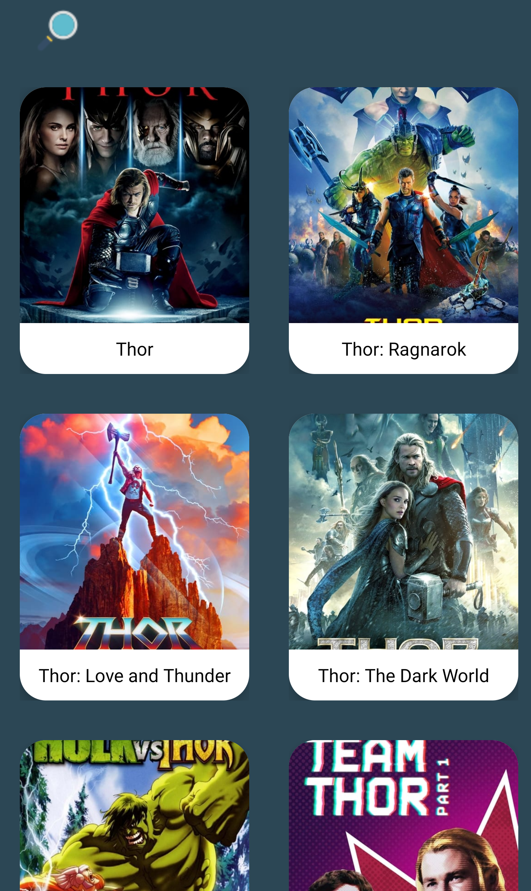

# **MovieApp-AndroidNativeJava**

### Description of the App:
Native Android created with Java Android Studio, allows you to browse for movies and series and shows info about them (description, rating,...etc.)
* **Technologies and Techniques Used**
  * Android Studio.
  * Native Java Language.
  * MVVM Pattern.
  * Retrofit Library for Http and API Request 
  * Android RecyclerView
  * Local Storage (SharedPrefernces, Intent and Bundles)
  * Lottie Library for purpose of Splash Screen Loading
 
 #### - Screenshots of the internal app after building:
</img>
</img>
</img>

* for the purpose of the Copyrights (credits) the following is used:
  * API: https://www.themoviedb.org/
